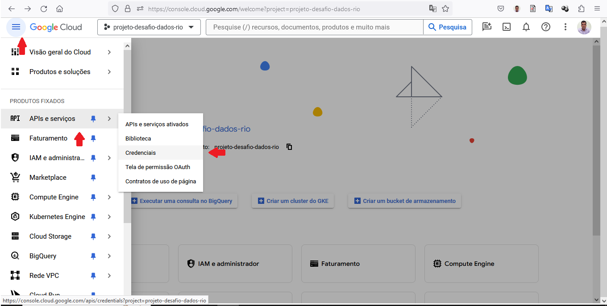
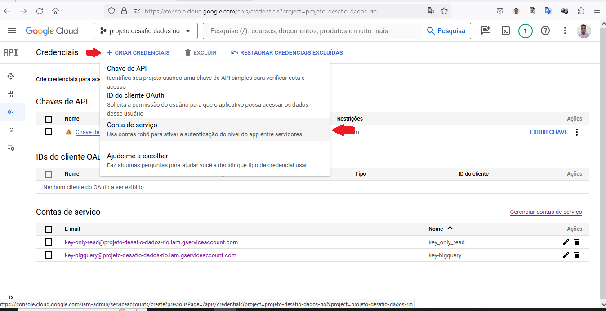
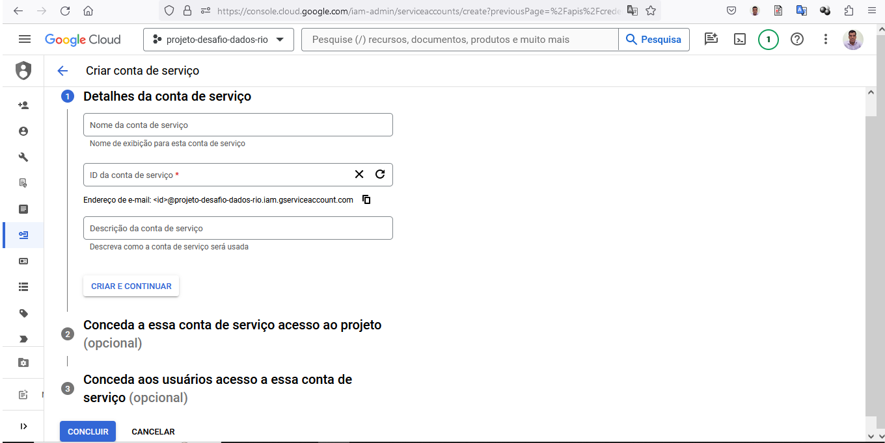
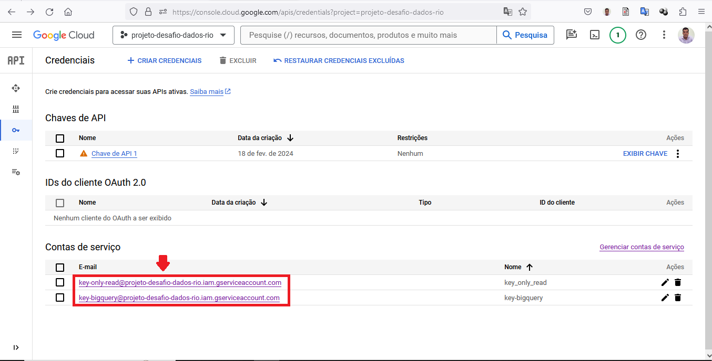
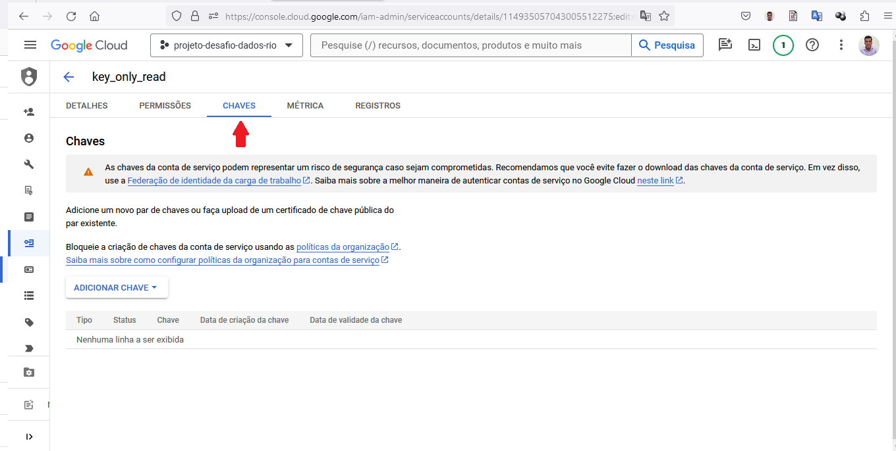
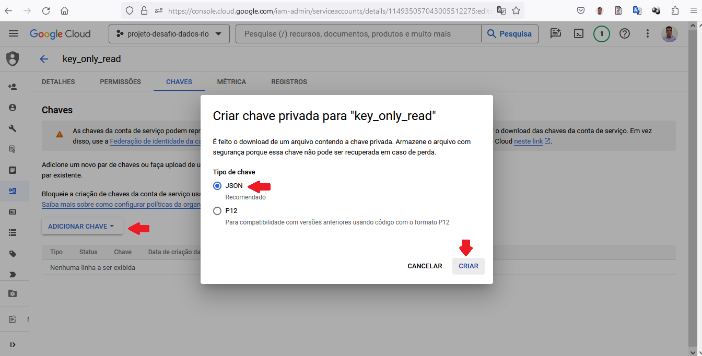

# Projeto para o Desafio Técnico - Cientista de Dados Júnior

<b>OBS.: Após inumeras tentativas para instalar a biblioteca `basedosdados`, não foi possível. 
Para contornar esse imprevisto foi utilizado a autenticação por credenciais fornecidas por arquivo JSON pelo Google Cloud - GCP. No indíce <a href="#iniciando-o-projeto">Gerando credenciais do Google Cloud - GCP</a> detalha como criar e inserir no Notebook Python para acesso ao GCP.</b>

<!-- TABLE OF CONTENTS -->
<details open="open">
  <summary>Indície</summary>
  <ol>
    <li>
      <a href="#objetivo">Objetivo</a>
      <ul>
        <li><a href="#programas-e-bibliotecas-utilizadas">Programas e bibliotecas utilizadas</a></li>
      </ul>
    </li>
    <li>
      <a href="#gerando-as-credenciais-do-google-cloud">Gerando as Credenciais do Google Cloud</a>
    </li>
    <li>
      <a href="#arquivos-e-pastas">Arquivos e Pastas</a>
    </li>
    <li>
      <a href="#sobre">Sobre</a>
    </li>
  </ol>
</details>

<!-- objetivo -->
## Objetivo

<p>Este repositório tem por finalidade fazer análises exploratórias em conjuntos de dados públicos disponíveis no BigQuery para o <b>Desafio Técnico - Cientista de Dados Júnior</b>.</br>
Foi realizado consultas com SQL, Python e criação de <i>Dashboards</i>.

<!-- programas-e-bibliotecas -->
### Programas e bibliotecas utilizadas

  * [google.cloud](https://cloud.google.com/python/docs/reference?hl=pt-br)
  * [pandas](https://pandas.pydata.org/)
  * [os](https://www.w3schools.com/python/module_os.asp)
  * [seaborn](https://seaborn.pydata.org/)
  * [satplotlib](https://matplotlib.org/)
  * [Docker](https://www.docker.com/)
  * [Docker Desktop](https://www.docker.com/products/docker-desktop/)
  * [Power bi](https://www.docker.com/)
  * [Apache Superset](https://superset.apache.org/)
  * [Google Cloud](https://cloud.google.com)
  * [Google BigQuery](https://cloud.google.com/bigquery/)
  
  <!-- Para gerar as credenciais de acesso no GCP -->
## Gerando as Credenciais do Google Cloud

Para gerar as credenciais acesse no GCP:


Em seguida irá mostrar a seguinte tela, cick no menu <b>`CRIAR CREDENCIAIS`</b> e no subitem <b>`Conta de Serviço`</b>:


Na tela seguinte irá aparecer um formulário para preenchimento com os dados da conta, em seguida no item 2(é opcional) será solicitado as permissões de acesso ao GCP, o item 3(é opcional) é para adicionar os usuários a essas credenciais, após concluir as etapas click em <b>`Concluir`</b>:


Após criar a credencial será possível verificar a mesma em <b>`Conta de Serviço`</b>:


Para gerar o arquivo <i>JSON</i>, click na credencial criada, em seguida no menu <b>`CHAVES`</b>:


Em seguida click no botão <b>ADICIONAR CHAVE</b>, será aberto um menu, click em <b>`Criar nova chave`</b> na tela que surgirá, selecione a opção `JSON`, será  gerada uma chave <i>JSON</i> que em seguida irá fazer o download da mesma. 


Para iserir no código e ter acesso ao GCP, segue abaixo um exemplo de código:

```python
# Importando as bibliotecas necessárias
from google.cloud import bigquery
import os
import pandas as pd

# Arquivo com as configurações para acessar o GCP
os.environ["GOOGLE_APPLICATION_CREDENTIALS"] = './key_only_read.json' # key_only_read.json é a credencial gerada pelo GCP que está localizada na raiz do projeto

# Nome do projeto no GCP
project_id = 'projeto-desafio-dados-rio'

client = bigquery.Client(project=project_id)

# Base de Dados Chamado 1746
query_chamado_1746      = "SELECT * FROM datario.administracao_servicos_publicos.chamado_1746 LIMIT 50000;"
df_query_chamado_1746   = client.query(query_chamado_1746).to_dataframe()

...
```

<!-- arquivos-e-pastas -->
## Arquivos e Pastas

  * `key_only_read.json` - credencial de acesso ao Google Cloud GCP;
    - OBS.: Está credencial é somente de leitura não podendo criar, atualizar e deletar tabelas. Foi permitido na sua criação somente a leitura das tabelas do projeto;
  * `analise_python.ipynb` - é o Notebook Python contendo o código fonte das respostas referente as perguntas;
  * `analise_sql.sql` - é o código fonte SQL das respostas referente as perguntas;
  * `dashboard_power_bi.pbix` - é o arquivo da <i>Dashboard</i> do <i>Power BI</i>.
  * pasta `docker-superset` - contém um arquivo <b>Docker</b> para a criação da VM do Superset da <i>Dashboard</i>. Na mesma contém um breve tutorial de como executar o mesmo;
  * pasta `notebooks-analise-exploratoria-dados` - contém os Notebooks da Análise Exploratória de Dados das tabelas:
    - `datario.administracao_servicos_publicos.chamado_1746`;
    - `datario.dados_mestres.bairro`;
    - `datario.turismo_fluxo_visitantes.rede_hoteleira_ocupacao_eventos`;
  * pasta `img` - contém imagens utilizadas na documentação;
  * pasta `extração-dados-parquet-csv` - contém o notebook para criar os arquivos `parquet` e `CSV` com os dados das tabelas. 

  <!-- sobre -->
## Sobre

 
Autor: `Thiago Vilarinho Lemes`<br>
 LinkedIn: [`Thiago Vilarinho Lemes`](https://www.linkedin.com/in/thiago-v-lemes-b1232727/)<br>
 email:  `contatothiagolemes@gmail.com` | lemes_vilarinho@yahoo.com.br`
