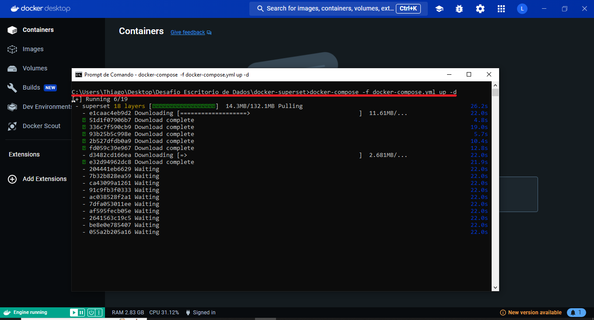
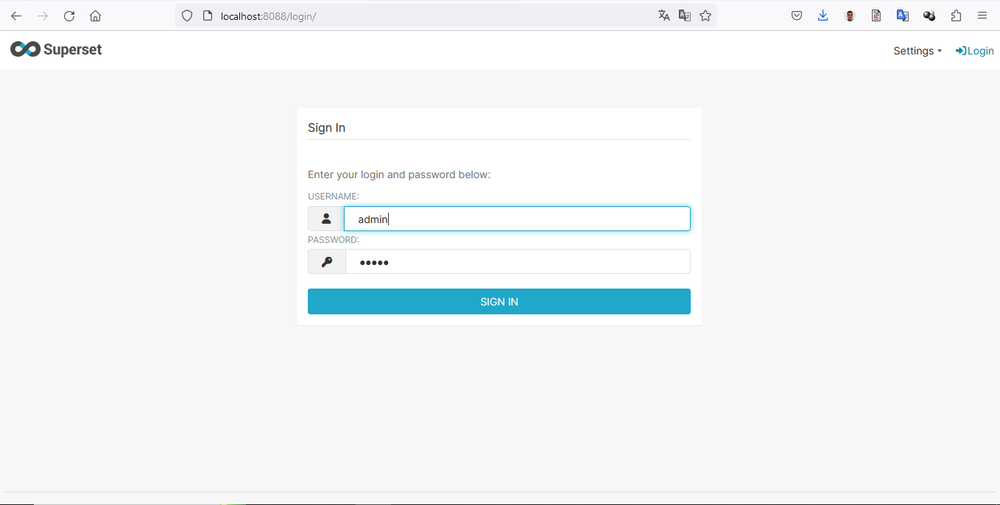
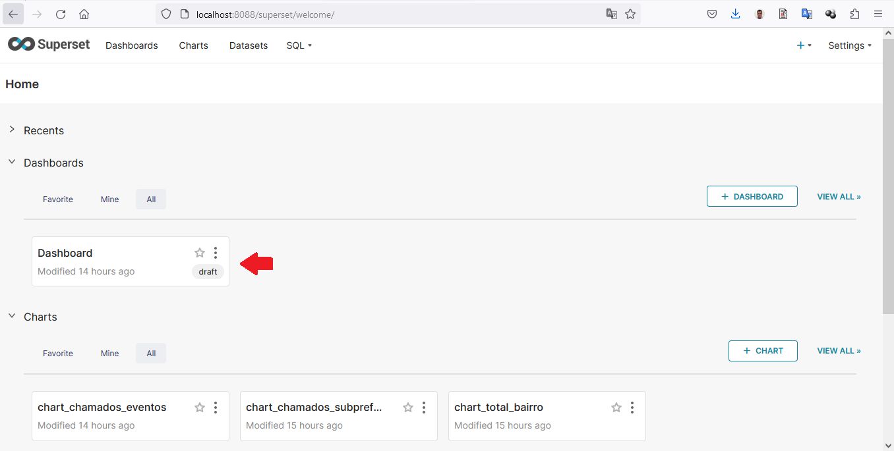
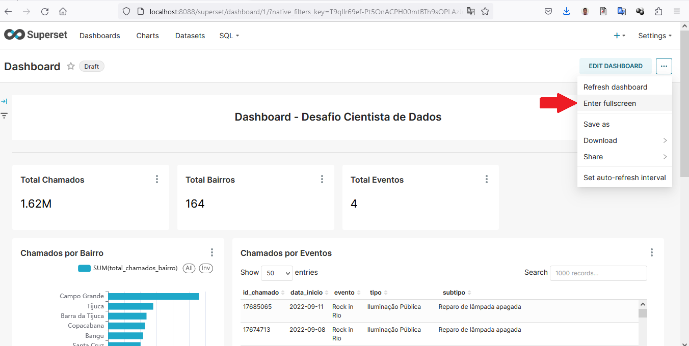
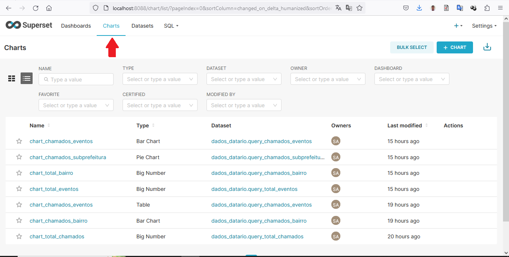
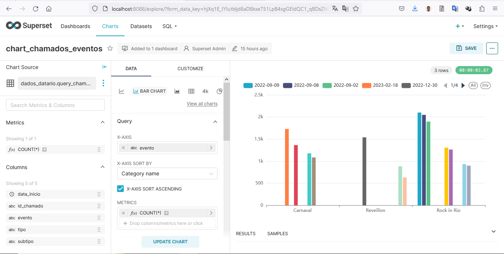
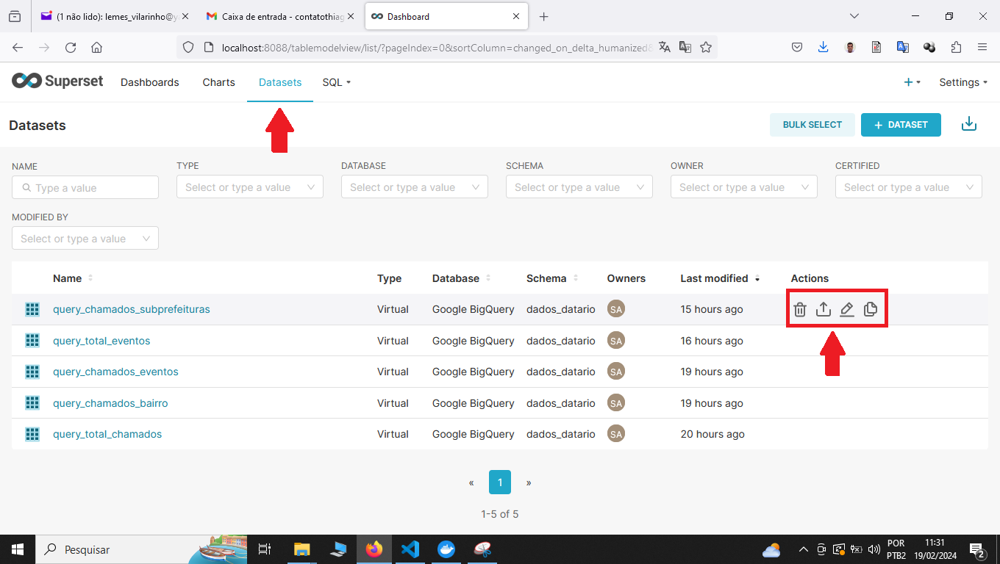
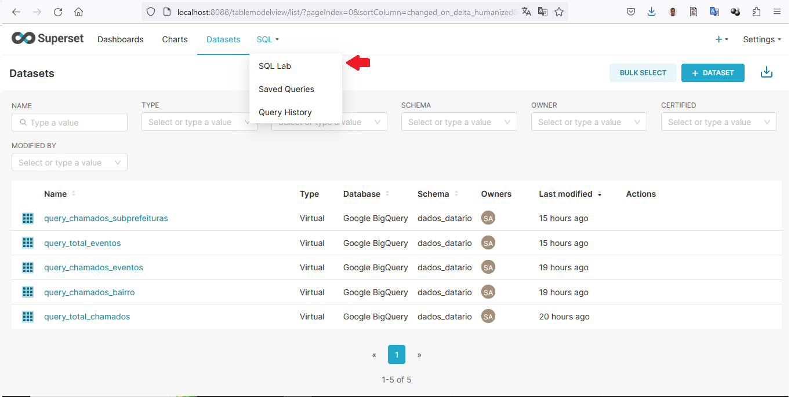

# Projeto para o Desafio Técnico - Cientista de Dados Júnior

<!-- TABLE OF CONTENTS -->
<details open="open">
  <summary>Indície</summary>
  <ol>
    <li>
      <a href="#objetivo">Objetivo</a>
      <ul>
        <li><a href="#programas-e-bibliotecas-utilizadas">Programas e bibliotecas utilizadas</a></li>
      </ul>
    </li>
    <li>
      <a href="#tutorial">Tutorial</a>
    </li>
    <li>
      <a href="#sobre">Sobre</a>
    </li>
  </ol>
</details>

<!-- objetivo -->
## Objetivo

<p>O objetivo desta pasta é fornecer os arquivos e um breve tutorial de como inicializar o <i>Docker</i> e o <i>Apache Superset</i>.<br>
O <i>Docker</i> é uma ferramenta de Virtualização.
O <i>Apache Superset</i> é uma ferramenta <i>Open Source</i>, com ela é possível criar <i> Dashboards</i> para diversos bancos de dados.

<!-- programas-e-bibliotecas -->
### Programas e bibliotecas utilizadas
  
  * [Apache Superset](https://superset.apache.org/)
  * [Docker Desktop](https://www.docker.com/products/docker-desktop/)
  * [Docker](https://www.docker.com)
  * [Google Cloud](https://cloud.google.com)
  * [BigQuery](https://cloud.google.com/bigquery/)
  
  <!-- Tutorial -->
## Tutorial

<p>Este tutorial não possui uma grande abrangência do <i>Docker</i> e o <i>Apache Superset</i>, é apenas para demonstrar como inicializar o funcionamento dos mesmos.</p>

<p>Para iniciar é preciso ter instalado o <i>Docker Desktop</i>, o mesmo pode ser feito o <i>Download</i> no link  <a href="https://www.docker.com/products/docker-desktop/">Docker Desktop</a>.</P>

Após instalar o <i>Docker Desktop</i>, dentro da pasta /docker-superset digite o comando:

```prompt
docker-compose -f docker-compose.yml up -d
```
 

Aguarde um momento para que a Máquina Virtual - VM, possa inicializar. Em seguida acesse o navegador no endereço http://localhost:8088.
 
Login:
USERNAME: admin
PASSWORD: admin

Em seguida surgirá a tela inicial do <i>Superset</i>. Para acessar a <i>Dashboard</i> criada para o desafio click no botão <i>Dashboard</i>:
 

Para visualizar em tela cheia:
 

No menu `Charts` é onde estão os charts, ou seja, os gráficos criados, sendo possível criar, exclui e edita-los acessando o link correspondente:
 
Exemplo de edição de gráfico:
 

No Meu `Datasets` podemos criar editar e excluir as consultas realizadas no banco de dados:
 

Em `SQL` no menu podemos criar consultas no banco de dados:
 

  <!-- sobre -->
## Sobre

 
Autor: `Thiago Vilarinho Lemes`<br>
 LinkedIn: [`Thiago Vilarinho Lemes`](https://www.linkedin.com/in/thiago-v-lemes-b1232727/)<br>
 email:  `contatothiagolemes@gmail.com` | lemes_vilarinho@yahoo.com.br`
